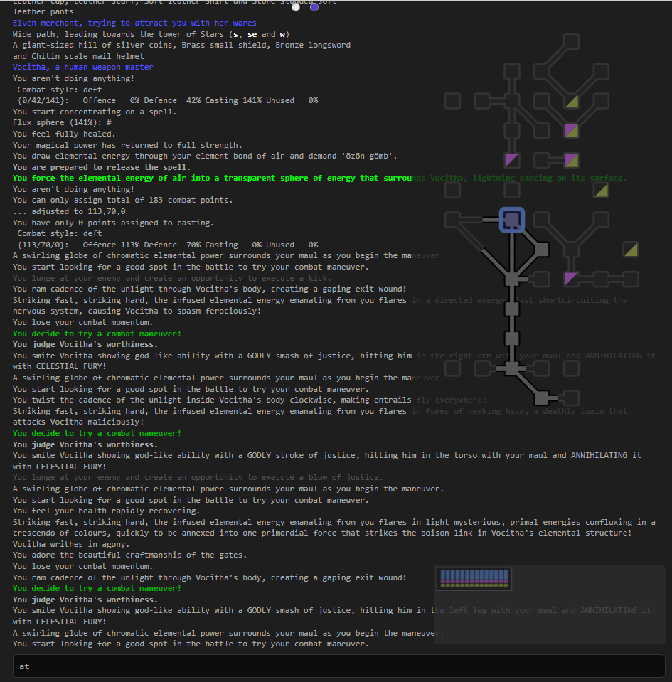

This is a Python Flask WebSocket web client for Icesus MUD,
providing a browser-based interface to connect and interact with the game

Example of an in-game overlay map. Unvisited rooms are shown as “etched” for clarity and contrast.

Note the status window as well: it uses a deliberately warm, unobtrusive design that avoids drawing too much attention while remaining easy on the eyes. Its color palette is aligned with the map for a consistent visual style.
